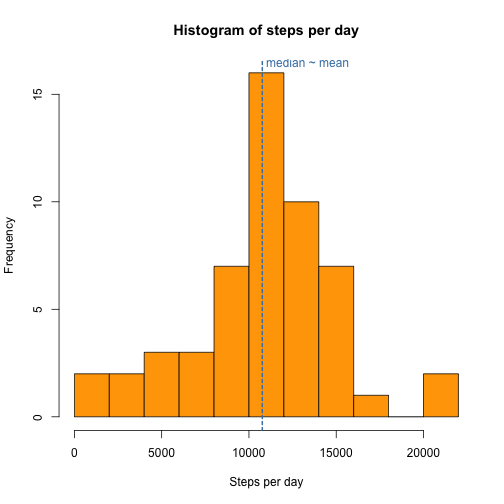
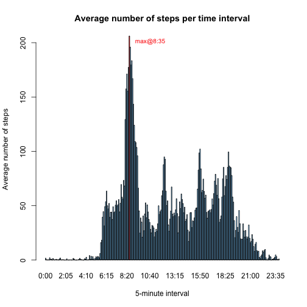
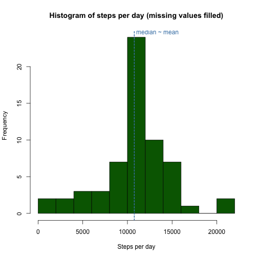
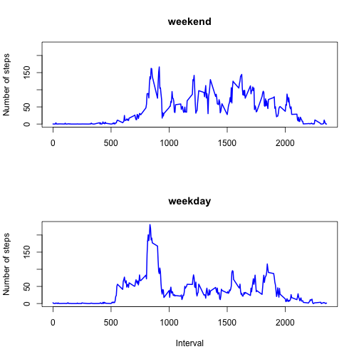

# Reproducible Research: Peer Assessment 1

In this assignment we analyze data from a personal activity monitoring device,
such as [Fitbit](http://www.fitbit.com/) or [Jawbone Up](https://jawbone.com/up).
The raw data si provided in file `activity.zip`.
Please refer to [readme file](README.md) for the description of the raw data
as well as detailed assignment instructions.

## Loading and preprocessing the data
To load and process the data, we need to do the following:

1. Unzip file `activity.zip`
2. Load the data using the `read.csv()` function
3. Convert date variable into class `Date`

The R code below performs these steps:

```r
unzip("activity.zip")
data <- read.csv(file = "activity.csv", na.strings = "NA", colClasses = c("integer", 
    "character", "integer"))
data$date <- as.Date(data$date, "%Y-%m-%d")
```


Some elementary statistics are shown below:

```r
str(data)
```

```
## 'data.frame':	17568 obs. of  3 variables:
##  $ steps   : int  NA NA NA NA NA NA NA NA NA NA ...
##  $ date    : Date, format: "2012-10-01" "2012-10-01" ...
##  $ interval: int  0 5 10 15 20 25 30 35 40 45 ...
```

```r
summary(data)
```

```
##      steps            date               interval   
##  Min.   :  0.0   Min.   :2012-10-01   Min.   :   0  
##  1st Qu.:  0.0   1st Qu.:2012-10-16   1st Qu.: 589  
##  Median :  0.0   Median :2012-10-31   Median :1178  
##  Mean   : 37.4   Mean   :2012-10-31   Mean   :1178  
##  3rd Qu.: 12.0   3rd Qu.:2012-11-15   3rd Qu.:1766  
##  Max.   :806.0   Max.   :2012-11-30   Max.   :2355  
##  NA's   :2304
```

```r
head(data)
```

```
##   steps       date interval
## 1    NA 2012-10-01        0
## 2    NA 2012-10-01        5
## 3    NA 2012-10-01       10
## 4    NA 2012-10-01       15
## 5    NA 2012-10-01       20
## 6    NA 2012-10-01       25
```


## What is mean total number of steps taken per day?

In this part of the assignment, we will ignore the missing values in the dataset:

```r
completeData <- data[complete.cases(data), ]
```

Hence, we will work with a dataset reduced to 15264 observations.

The following histogram shows the total number of steps per day:

```r
completeData$day <- as.factor(as.character(completeData$date))
totalStepsPerDay <- tapply(completeData$steps, completeData$day, sum)
hist(totalStepsPerDay, breaks = 8, col = "orange", main = "Histogram of steps per day", 
    xlab = "Steps per day", )
abline(v = median(totalStepsPerDay), col = "steelblue", lwd = "2", lty = "22")
text(median(totalStepsPerDay) + 2600, 16.5, "median ~ mean", col = "steelblue")
```

 

The **mean** and **median** of total number of steps taken per day are 
**1.0766 &times; 10<sup>4</sup>** and **10765**, respectively.


## What is the average daily activity pattern?

To answer the research questions of this section, we first need the following helper function:

```r
formatTime <- function(x) {
    x <- sub("^\\s*", "", x)
    len <- nchar(x)
    if (len < 2) {
        paste0("0:0", x)
    } else if (len < 3) {
        paste0("0:", x)
    } else if (len < 4) {
        sub("(\\d)(\\d\\d)", "\\1:\\2", x)
    } else {
        sub("(\\d\\d)(\\d\\d)", "\\1:\\2", x)
    }
}
```


The following plot shows the average number of steps taken for each 5-minute time interval:

```r
numberOfIntervals <- 12 * 24
timeIntervals <- data$interval[1:numberOfIntervals]
timeLevels <- sapply(timeIntervals, formatTime)
completeData$time <- factor(sapply(completeData$interval, formatTime), levels = timeLevels, 
    ordered = TRUE)
timeSeries <- tapply(completeData$steps, completeData$time, mean)

colors <- rep("lightskyblue", dim(timeSeries))
colors[which.max(timeSeries)] <- "red"
barplot(timeSeries, col = colors, xlab = "5-minute intervals", ylab = "Average number of steps")
max <- timeSeries[timeSeries == max(timeSeries)]
maxIndex <- which.max(timeSeries)
text(155, max - 5, paste0("max@", names(timeSeries[maxIndex])), col = "red", 
    cex = 0.85)
```

 

As depicted in the figure above, the 5-minute interval at **8:35** contains
the maximum average number of steps, **206.1698**.


## Imputing missing values

The original dataset contains **17568** observations, out of which
**15264** are complete, i.e. do not contain missing values.
This implies that there are **2304** observations
with missing values. The following R code was used to obtain these values:

```r
count <- dim(data)[1]
countComplete <- sum(complete.cases(data))
countIncomplete <- count - countComplete
```


There are several strategies we could use to fill in missing values, such as:

* Replace missing values with zeros
* Replace missing values with average number of steps for that time interval

We will use the latter strategy. The following code creates a new, tidy dataset,
with missing values replaced with averages for the respective time interval:

```r
intervalMean <- function(x) {
    index <- formatTime(x)
    timeSeries[index]
}

computeCompleteSteps <- function(x) {
    x["steps"] <- ifelse(is.na(x["steps"]), intervalMean(x["interval"]), x["steps"])
    x
}

tidyData <- data.frame(t(apply(data, 1, computeCompleteSteps)))
tidyData$steps <- as.numeric(as.character(tidyData$steps))
tidyData$date <- as.Date(tidyData$date, "%Y-%m-%d")
tidyData$interval <- as.integer(as.character(tidyData$interval))
```


Some simple statistics about this new dataset are shown below:

```r
str(tidyData)
```

```
## 'data.frame':	17568 obs. of  3 variables:
##  $ steps   : num  1.717 0.3396 0.1321 0.1509 0.0755 ...
##  $ date    : Date, format: "2012-10-01" "2012-10-01" ...
##  $ interval: int  0 5 10 15 20 25 30 35 40 45 ...
```

```r
summary(tidyData)
```

```
##      steps            date               interval   
##  Min.   :  0.0   Min.   :2012-10-01   Min.   :   0  
##  1st Qu.:  0.0   1st Qu.:2012-10-16   1st Qu.: 589  
##  Median :  0.0   Median :2012-10-31   Median :1178  
##  Mean   : 37.4   Mean   :2012-10-31   Mean   :1178  
##  3rd Qu.: 27.0   3rd Qu.:2012-11-15   3rd Qu.:1766  
##  Max.   :806.0   Max.   :2012-11-30   Max.   :2355
```

```r
head(tidyData)
```

```
##     steps       date interval
## 1 1.71698 2012-10-01        0
## 2 0.33962 2012-10-01        5
## 3 0.13208 2012-10-01       10
## 4 0.15094 2012-10-01       15
## 5 0.07547 2012-10-01       20
## 6 2.09434 2012-10-01       25
```


The following histogram shows the total number of steps per day for this tidy dataset:

```r
tidyData$day <- as.factor(as.character(tidyData$date))
totalStepsPerDay2 <- tapply(tidyData$steps, tidyData$day, sum)

hist(totalStepsPerDay2, breaks = 8, col = "orange", main = "Histogram of steps per day", 
    xlab = "Steps per day")
abline(v = median(totalStepsPerDay2), col = "steelblue", lwd = "2", lty = "22")
text(median(totalStepsPerDay2) + 2600, 24.75, "median ~ mean", col = "steelblue")
```

 


The previous dataset that included only complete cases had data for **53 days**.
By replacing missing values with averages, we created data for additional 
**8 days**, with total number of steps that is
the sum of averages for every interval.
As a result, the **mean** and **median** remain largely unchanged,
**1.0766 &times; 10<sup>4</sup>** and **1.0766 &times; 10<sup>4</sup>**, respectively.
As the histogram shows, the number of days in the same bin as the median (and mean) value
increased by at least the aforementioned **8 days**.


## Are there differences in activity patterns between weekdays and weekends?

The following R code creates a new factor variable that indicates for each observation whether
it was recorded on a weekday or a weekend day:

```r
isWeekDay <- function(x) {
    day <- weekdays(x)
    day != "Saturday" & day != "Sunday"
}

dayType <- function(x) {
    ifelse(isWeekDay(x), "weekday", "weekend")
}

tidyData$daytype <- factor(sapply(tidyData$date, dayType), levels = c("weekday", 
    "weekend"))
```


The following plot shows a comparison betweeen the average number of steps taken for each 5-minute time interval during the weekend days and during the weekdays:

```r
weekend <- split(tidyData, tidyData$daytype)$weekend
weekday <- split(tidyData, tidyData$daytype)$weekday
timeSeriesWeekend <- tapply(weekend$steps, weekend$interval, mean)
timeSeriesWeekday <- tapply(weekday$steps, weekday$interval, mean)

par(mfrow = c(2, 1))
plot(as.numeric(names(timeSeriesWeekend)), timeSeriesWeekend, type = "l", lwd = 2, 
    col = "blue", ylim = c(0, 230), main = "weekend", xlab = "", ylab = "Number of steps")

plot(as.numeric(names(timeSeriesWeekday)), timeSeriesWeekday, type = "l", lwd = 2, 
    col = "blue", ylim = c(0, 230), main = "weekday", xlab = "Interval", ylab = "Number of steps")
```

 

